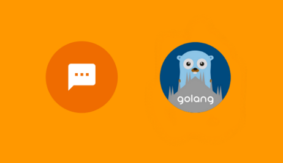

# dialogflow-go-client

[](https://circleci.com/gh/mlabouardy/dialogflow-go-client) [](https://opensource.org/licenses/Apache-2.0) [](https://goreportcard.com/report/github.com/mlabouardy/apiai-go-client)

<div align="center">
	
</div>

This library allows integrating agents from the [DialogFlow](https://dialogflow.com) natural language processing service with your Golang application.

* [Prerequsites](#prerequsites)
* [Installation](#installation)
* [Features](#features)
* [Usage](#usage)
* [Documentation](#documentation)

# Prerequsites

Create an [DialogFlow account](https://dialogflow.com/).

# Installation

```shell
go get github.com/mlabouardy/dialogflow-go-client
```

# Features

* Queries
* Contexts
* Intents
* UserIntents
* Entities

# Usage

* Create `main.go` file with the following code:
```golang
package main

import (
	"fmt"
	"github.com/mlabouardy/dialogflow-go-client"
	"github.com/mlabouardy/dialogflow-go-client/models"
	"log"
)

func main() {
	err, client := NewDialogFlowClient(Options{
		AccessToken: "<API.AI TOKEN GOES HERE>",
	})
	if err != nil {
		log.Fatal(err)
	}

	entities, err := client.EntitiesFindAllRequest()
	if err != nil {
		log.Fatal(err)
	}
	for _, entity := range entities {
		fmt.Println(entity.Name)
	}
}
```
* Run following command.
```shell
go run main.go
```
* Your can find more examples in [`examples`](examples) directory.

# Tutorials

* [Messenger Bot with DialogFlow & Golang](http://www.blog.labouardy.com/bot-in-messenger-with-dialogflow-golang/)

# Documentation

Documentation is available at https://dialogflow.com/docs.
